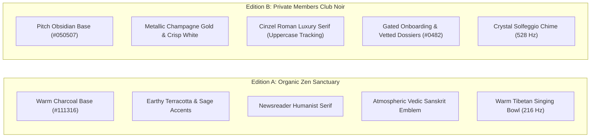
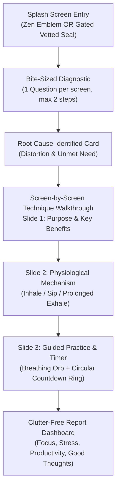

# Adhyay (अध्याय): From Overwhelmed to Clear
## Product Strategy, Dual-Edition (A/B) Architecture & Google Play Store Execution Plan

---

## Executive Summary & Vision

**Adhyay Foundation** is an active guided reflection and mental clarity system designed to unpack internal chaos into factual, physiological calm in **under 2 to 5 minutes**.

To deliver an exceptional experience tailored to different user sensibilities, Adhyay now features a **Dual-Edition (A/B) System**:
1. **Edition A: Organic Zen Sanctuary** (Warm Terracotta, Forest Sage, Warm Sand, Newsreader Editorial Serif).
2. **Edition B: Private Members Club Noir** (High-Contrast Monochrome, Metallic Champagne Gold, Cinzel Roman Serif, Gated Velvet-Rope Onboarding, Curated Executive Portfolios).

Users can toggle seamlessly between **Edition A** and **Edition B** in real time via the top preview bar or the in-app header pill.

---

## 1. Dual-Edition (A/B) Aesthetic Comparison

| Aesthetic Dimension | Edition A: Organic Zen Sanctuary | Edition B: Private Members Club Noir |
| :--- | :--- | :--- |
| **Monochrome Foundation** | Warm Espresso Charcoal (`#111316`, `#171A1F`) | Deep Pitch Obsidian (`#050507`, `#0A0A0E`, `#111116`) |
| **Accent Colors** | Earthy Terracotta (`#D97757`) & Forest Sage (`#5B8266`) | Metallic Champagne Gold (`#D4AF37`) & Rich Burgundy (`#8C1D40`) |
| **Typography** | `Newsreader` (Editorial Serif) + `Plus Jakarta Sans` | `Cinzel` (Roman Fashion Serif) + `Cormorant Garamond` (Thin Sans) |
| **Card Architecture** | Rounded organic cards (14px radius) | Razor-sharp luxury borders (6px radius) & generous whitespace |
| **Imagery / Visual Assets** | Calm sacred geometric rings | B&W portraits shifting to champagne gold on interaction |
| **Onboarding Tone** | Compassionate grounding & Socratic reflection | Gated velvet rope ("Status: Vetted • Founding Fellow No. 0482") |
| **Audio Synthesizer** | Harmonic Tibetan singing bowl strike (216 Hz) | Crystal Solfeggio transformation chime (528 Hz) |

---

## 2. The 5 Core Pillars in Both Editions

Regardless of whether Edition A or Edition B is selected, the application rigorously delivers the 5 core user requirements:

1. **Pillar 1: Relevancy**:
   - Adaptive, context-aware 2-step diagnostic tree.
   - 5 primary emotional gateways (Overwhelmed, Overthinking, Self-Doubt, Decision Freeze, Emotional Heaviness).
2. **Pillar 2: Relaxation Techniques Being Factual**:
   - All protocols cite peer-reviewed literature:
     * *The Physiological Sigh* (Stanford Medicine / Huberman Lab, 2023)
     * *Box Breathing (Sama Vritti)* (Navy SEALs / Marcinkowski, 2018)
     * *4-7-8 Parasympathetic Vagal Reset* (Dr. Andrew Weil, Harvard Health)
     * *Jacobson Somatic Muscle Release (PMR)* (Edmund Jacobson, Cambridge)
     * *5-4-3-2-1 Sensory Grounding* (Cognitive Behavioral Therapy)
     * *Coherence Breathing (5.5s)* (HeartMath Institute / Resonance Frequency)
     * *Loving-Kindness & Good Thoughts (Metta)* (Dr. Barbara Fredrickson, UNC)
3. **Pillar 3: Identification & Proper Recommendation**:
   - Adhyay Thought Decoder identifies the **Core Cognitive Distortion** (e.g. *Catastrophic Compounding*), **Underlying Unmet Need** (e.g. *Nervous System Downregulation*), and prescribes the exact tailored protocol.
4. **Pillar 4: Report Summary (Parameters Without Clutter)**:
   - High-contrast, uncluttered metric cards:
     * **Focus Increase** (+38%)
     * **Stress Decrease** (-44%)
     * **Productivity Boost** (+31%)
     * **Good-Natured & Positive Thoughts** (+52%)
     * **Adhyay Clarity Index** (92/100)
     * **Reframed Truth** (Contrast between anxious loop and reality)
     * **1 Smart Micro-Action** (Bite-sized, immediate non-overwhelming step).
5. **Pillar 5: Mindful Text Per Screen Limit**:
   - Strict rule of 1-2 lines per screen. Tap-friendly cards, zero walls of text.

---

## 3. The Science Tab: Directory & Research Articles

### A. Full Meditation & Relaxation Techniques Directory
Each technique card provides:
- Exact Scientific Category & Institutional Origin
- Core Physiological Purpose
- Verified Biological Benefits (alveoli inflation, vagal cardiac brake, DMN disengagement)
- Direct **"Practice in Studio →"** button.

### B. Interactive Research Articles
1. **The Amygdala Hijack**: What happens under acute overwhelm (the 90-second neurochemical wave).
2. **Why Passive Listening Fails**: The science of active guided reflection vs ambient distraction.
3. **The Heart-Brain Axis**: The biomechanics of respiratory sinus arrhythmia and the vagal brake.

---

## 4. Google Play Store Readiness

- **Capacitor Configuration**: [`capacitor.config.json`](file:///d:/Experiences/skillizee/Adhyay/capacitor.config.json) configured for `com.adhyay.foundation`.
- **Web App Manifest**: [`manifest.json`](file:///d:/Experiences/skillizee/Adhyay/manifest.json) configured for standalone Play Store PWA / TWA installation.
- **Offline Service Worker**: [`sw.js`](file:///d:/Experiences/skillizee/Adhyay/sw.js) for full offline caching.
- **Icons**: Scalable vector app icons ([icon-192.svg](file:///d:/Experiences/skillizee/Adhyay/icon-192.svg) and [icon-512.svg](file:///d:/Experiences/skillizee/Adhyay/icon-512.svg)).
